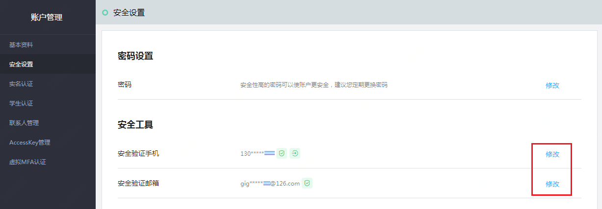
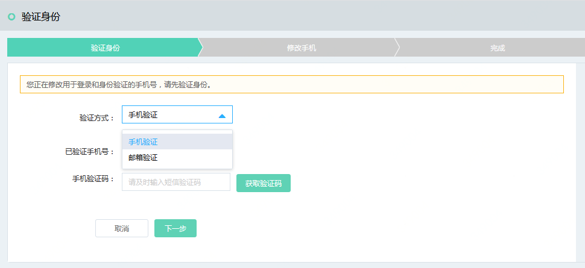
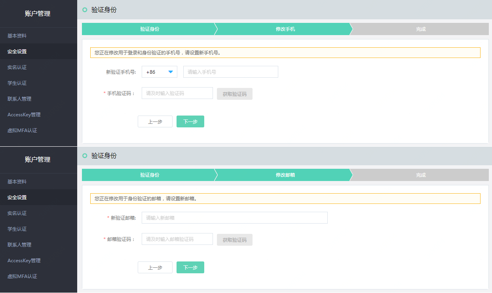
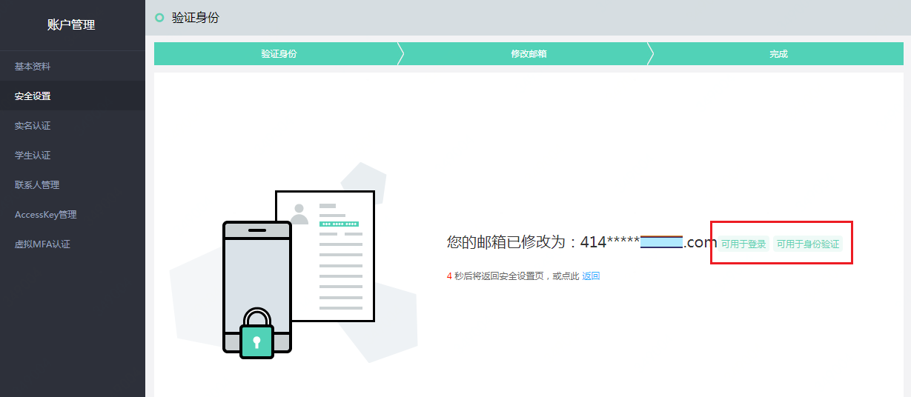

# Manage associated mobile phone or email

(If you are using a JD account, please conduct operation by referring to [JD Account Management](../../../documentation/User-Service/Account-Management/Check-Your-Account.md).)

The mobile phone number and email associated to an account are the safety tools verifying identity of the account operator. In case of sensitive or abnormal operation, verification can be made via a mobile phone number or an email, to guarantee account safety.
The mobile phone number and email are also the main method for receiving JD Cloud’s important notices, such as resource expiration and release, monitoring alarm and other messages. Meanwhile, for the user having only one account in JD Cloud, he/she can log in JD Cloud with the mobile phone number or email associated with the account.

## Firstly associate mobile phone number and email

When a JD Cloud account is registered, one valid mobile phone number shall be filled in and this account will be associated with the mobile phone number after registration.

After successful registration, JD Cloud will guide you to complete an email. If this operation is not made, you can associate an email on the "Account Management - Security Setting" page, as shown in Figure 1. After the email is completed, JD Cloud will send a verification email. After the verification is completed, the account is associated with this email. Before verification, this email is in the "un-verified" status and cannot be used for identity verification or for receiving information, as shown in Figure 2 - Figure 3.

Figure 1: Add emails on security setting page

Figure 2: Unchecked email cannot be used for identity verification and message reception

Figure 3: Check email or change email

## View associated mobile phone number and email

On the "Account Management - Security Setting" page, you can view the mobile phone number and email associated to the account and check if the account can be logged in via the mobile phone number and email, as shown in Figure 4.

Icon  means the mobile phone number or the email can be used for identity verification (the un-verified email cannot be used for identity verification);
Icon  means that the mobile phone number or the email can be used for login

Figure 4: View if the mobile phone number and email can be used for login

## Modify associated mobile phone number and email

If the account administrator changes his/her mobile phone number or the account administrator is changed, please update the mobile phone number or email associated to the account in time, as shown in Figure 5 - Figure 8.

Figure 5: click **modify mobile phone number or email** (if you need to modify the unchecked email, please just click **Check**, as shown in Figure 3)

Figure 6: Modify operator’s identity and select an available verification method (if the mobile phone is unavailable, please contact the customer service by a ticket or the hot line 400-615-1212 for mobile phone number modification assistance)

Figure 7: Modify the mobile phone number or email, after modification, the account login method might be changed

Figure 8: Complete modification and view if the mobile phone number or email can be used for login after modification. Only when this mobile phone number or email is not associated with any account, it can be used for login; otherwise, it can only be used for security verification

