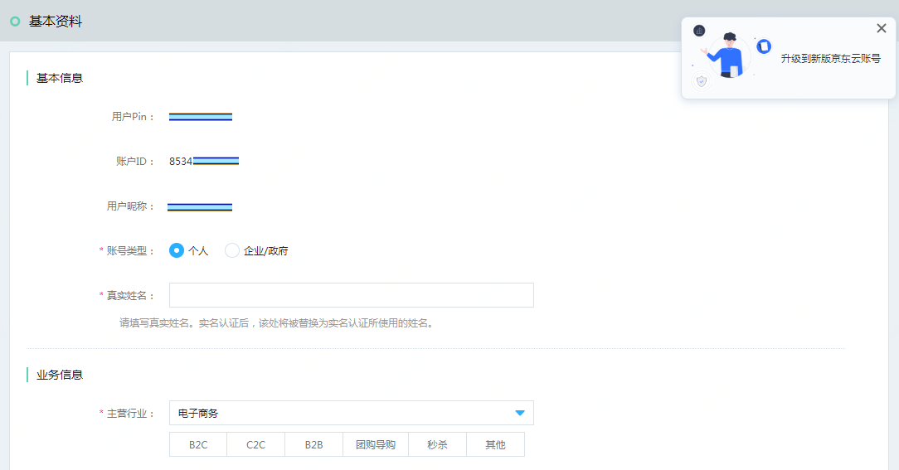
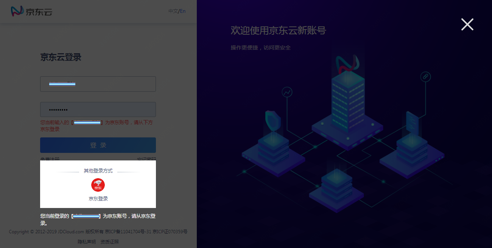

# JD Account Management

This document will introduce how to manage an un-upgraded JD account and how to disable a JD account after upgrade.

## Glossary
**What's an un-upgraded JD account**

Since the account system of JD Cloud conducts overall upgrade, the cloud account independent from JD personal business can be used from July 18, 2019 and any other accounts registered prior to that day are attributed to the account system of JD Mall. If you see the following page when you access "[Account Management-Basic Data](https://uc.jdcloud.com/account/basic-info)", it means that your account is attributed to the un-upgraded JD account:

**What's a JD Cloud account**

JD Cloud Account is a brand new account system, with the following features:
* Isolated to individual business of JD Mall and more friendly to enterprise user
* Not subject to the login rules of JD Mall and support customized JD Cloud login policy
* More convenient operation of upgrade of account management center

**What's account upgrade**

Account upgrade means the process in which a JD account is upgraded to an independent account of JD Cloud. You can still access JD Cloud via your JD account, but the new JD Cloud account fit in cloud users’ using habits better. Most of the resources and services of JD Cloud are consistent for JD Cloud account and JD account. However, the un-upgraded JD account cannot use some account management functions including:
* Cannot set login IP protection
* Cannot log in with WeChat

If you need to use these functions, please upgrade your account. The account upgrade portal is on the page "[Account Management-Basic Data](https://uc.jdcloud.com/account/basic-info)".

The account name and password set in the upgrade process are irrelevant with the user name and password of the original JD account, but their underlayer is corresponding to the same one account entity, so all of your JD Cloud services and cloud resources will not be affected after the upgrade. The relation between JD Cloud account and JD account after upgrade is shown in the figure as below:

## Manage un-upgraded JD account
### JD Account Login

In JD Cloud, you can use the JD account to enable business. When using a JD account to log in, please select **JD Login** below the login page.

### Management phone number, email and password

Please modify login mobile phone number, login email and login password of JD account in JD Mall. After the modification, the information will not be synchronized to JD Cloud.

You can manage the contact phone number and email on JD Cloud page "[Account Management - Security Settings](https://uc.jdcloud.com/account/security-settings)". They will be only used when you are contacted or sent a notification through JD Cloud. The contact phone number and email may be different from the login phone number and login email of your JD account and will not be synchronized to your JD account after modification.

### View account information

You can view the account information on the page  "[Account Management-Basic Data](https://uc.jdcloud.com/account/basic-info)". The user Pin is the JD account user name and the only identifier of JD account; the account ID is generated by JD Cloud system and some JD Cloud services will use the account ID to implement authorization among accounts, e.g. Identity and Access Management (IAM).

## Disable JD account after upgrade

After the account is upgraded, you can use the account name and password set during the upgrade to directly log in JD Cloud instead of JD login. Because the JD account is attributed to individual, when the employee of the enterprise leaves office or is transferred, the enterprise may need to disable his or her continuous access to the cloud Console.

You can disable or enable again the access to JD account on the page "[Account Management - Security Settings](https://uc.jdcloud.com/account/security-settings)".

After the JD login is disabled, users will be removed compulsorily if they access the Console through JD login, and can no more login to JD Cloud APP through JD account.

