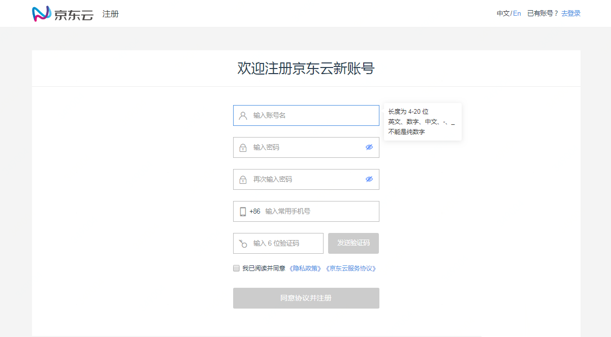
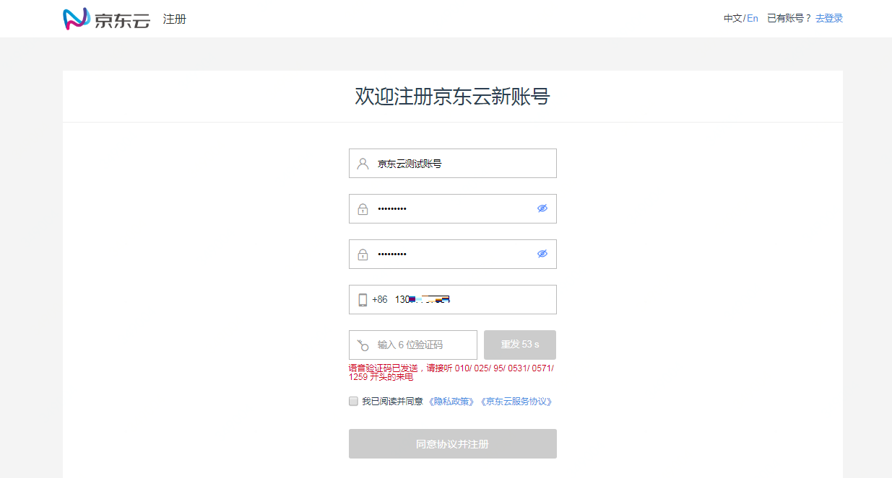
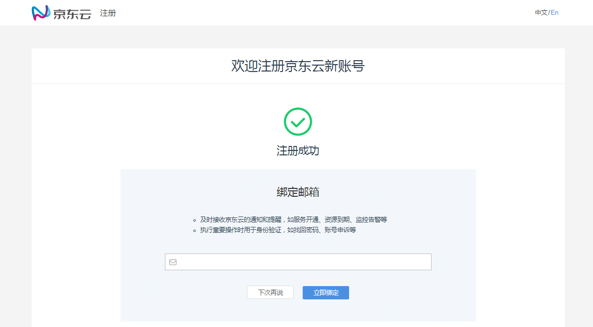
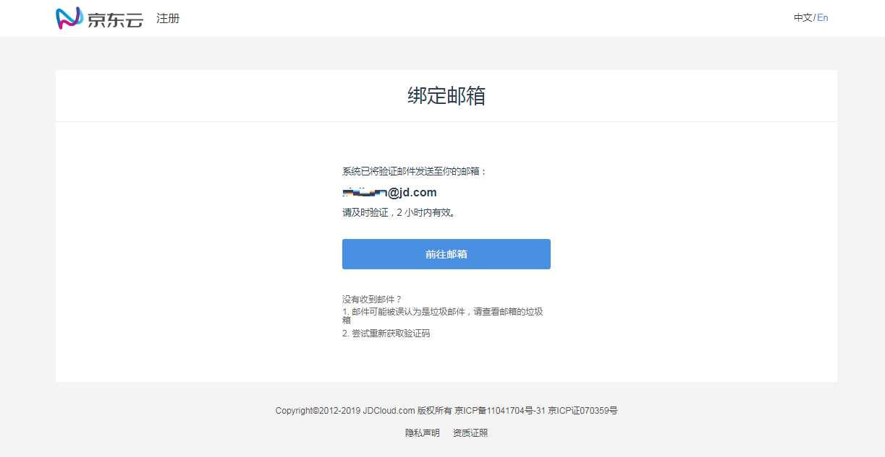
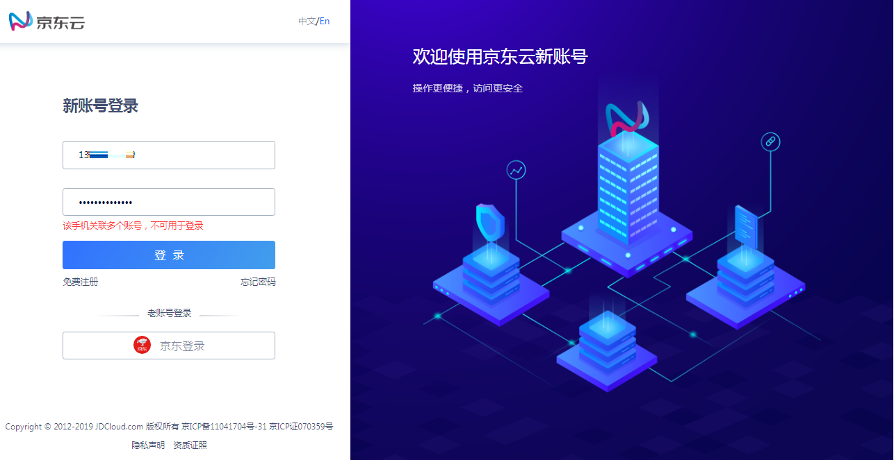
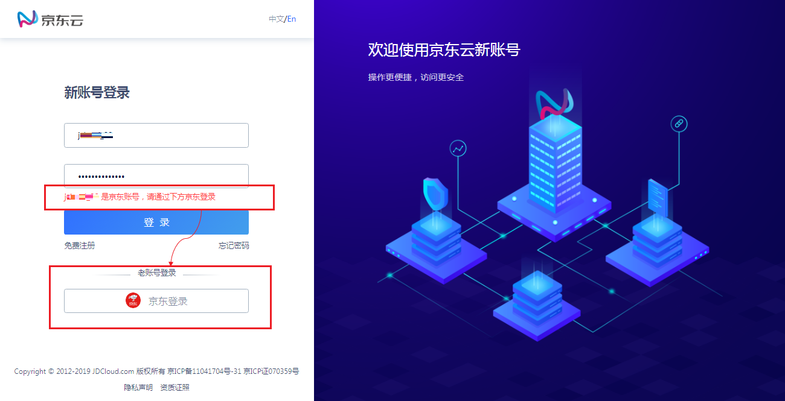

# Login and Registration
## Register an Account
Newly registered accounts at all JD Cloud registry entries (except JD Cloud APP) are JD Cloud’s independent accounts, which cannot log in to JD Mall.
Currently, JD Cloud only supports registration by the mainland mobile phone number, with the steps as follows:

### 1. Enter account name and password
The page notifies for entry rules upon entering:
The length of the account name is 4-20 bits. Chinese characters, English letters, numbers or symbols of "-" and "_" can be entered. Account names in pure digital format are not supported;
The login password length is 7-20 bits. The password must contain English letters, numbers, and symbols (support for English symbols other than spaces), and the password must not be the same as the account name.

### 2. Enter a commonly used mobile phone number, as the security phone number of the account
Please use your regular mobile phone number for verification. The verification code may be sent by SMS or phone call. If the alternative mobile phone number is used for registration, because the network of secondary number is not stable, there may be problems of not receiving SMS or phone calls occasionally. Please wait for a while and try again later.

After successful registration, the phone number will become a security phone number associated to the account, used to receive important notifications from JD Cloud, and as a method of security verification of your account.
If your mobile phone number is used to subscribe JD Cloud service for the first time, the mobile phone number can be used for account login; if the mobile phone number has been associated with other JD Cloud Account, your mobile phone number cannot be used for login of the account you are currently registering.

### 3. Supplement Security Email
When the registration is completed, it will guide you to Email association, which can be skipped. Email is one of the main methods for JD Cloud to contact users. In order not to miss the change information, monitoring alarm, account information of JD Cloud resources and services, it is suggested to fill in and verify the Email.

After filling in, JD Cloud will send a verification Email to your mailbox. Please go to the mailbox and click the verification link as soon as possible to verify the Email. The validity of the verification link is 2 hours. If your Email is used to subscribe JD Cloud service for the first time, the Email can be used for account login after successful verification; if the mobile phone number has been associated with other JD Cloud Account, the Email can only be used for identity verification and message receiving, which cannot be used for login of the account you are currently registering.

## Login Accounts

### 1. Login of New JD Cloud Account
Since July 19, 2019, the newly registered JD Cloud account or the account that has been upgraded can be logged in directly through JD Cloud account.

If you use your mobile phone number or Email for login, it notifies that "This mobile phone number/email has been associated with multiple accounts and cannot be used for login", it means your mobile phone number or email cannot be used for login, please use the account name plus password directly for login.

### 2. Login through JD
If you have subscribed JD Cloud service before July 19, 2019 and have not upgraded your account, you can log in through the JD account.

