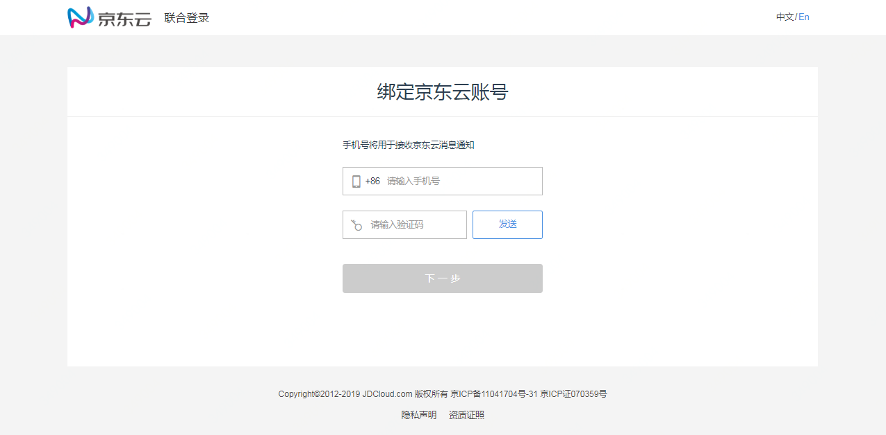
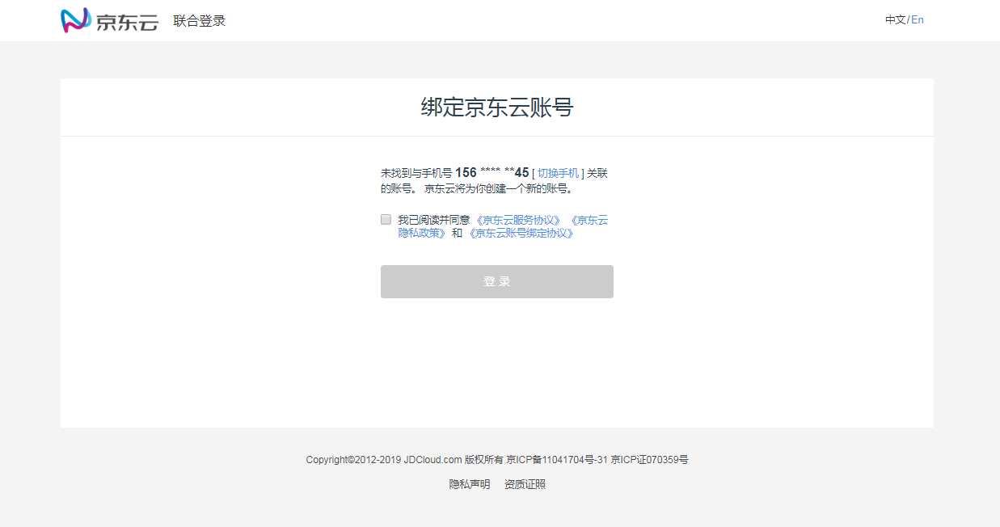

# Login and Registration
## Register an Account
The account registered at JD Cloud cannot be used for logging in JD Mall. Currently, JD Cloud only supports registration by the mainland mobile phone number, with the steps as follows:

### 1. Enter account name and password
The account name is the identifier of JD Cloud account for login. The page notifies for entry rules upon entering:
The length of the account name is 4-20 bits. Chinese characters, English letters, numbers or symbols of "-" and "_" can be entered. Account names in pure digital format are not supported;
The login password length is 7-20 bits. The password must contain English letters, numbers, and symbols (support for English symbols other than spaces), and the password must not be the same as the account name.

### 2. Enter a commonly used mobile phone number, as the security phone number of the account
Please use your regular mobile phone number for verification. The verification code may be sent by SMS or phone call. If the alternative mobile phone number is used for registration, because the network of secondary number is not stable, there may be problems of not receiving SMS or phone calls occasionally. Please wait for a while and try again later.

After successful registration, the phone number will become a security phone number associated to the account, used to receive important notifications from JD Cloud, and as a method of security verification of your account.
If your mobile phone number is used to subscribe JD Cloud service for the first time, the mobile phone number can be used for account login; if the mobile phone number has been associated with other JD Cloud Account, your mobile phone number cannot be used for login of the account you are currently registering.

### 3. Supplement Security Email
When the registration is completed, it will guide you to Email association, which can be skipped. Email is one of the main methods for JD Cloud to contact users. In order not to miss the change information, monitoring alarm, account information of JD Cloud resources and services, it is suggested to fill in and verify the Email.

After filling in, JD Cloud will send a verification Email to your mailbox. Please go to the mailbox and click the verification link as soon as possible to verify the Email. The validity of the verification link is 2 hours. If your Email is used to subscribe JD Cloud service for the first time, the Email can be used for account login after successful verification; if the mobile phone number has been associated with other JD Cloud Account, the Email can only be used for identity verification and message receiving, which cannot be used for login of the account you are currently registering.

## Login Accounts

### 1. Login via Scanning Code
You are recommended to use [JD Cloud App](https://console.jdcloud.com/download) to log in via scanning code. Search "JD Cloud" at major application shops to download and use. After scanning the code, confirm the login in the mobile phone, and you can log in on computer synchronously.

### 2. Login via Password
You can enter account name and password to log in.

Some users can also log in via the mobile phone number or email and the password, subject to the case that your mobile phone numbers or emails are associated with the unique account in JD Cloud.
* If you receive a notification saying that "this mobile phone number/email cannot be used for login", it means that your account does not support login with mobile phone number or email. In such case, please try to enter your account name;
* If you confirm that this mobile phone number or email has been used for login to JD Cloud successfully, you might be the early users of JD Cloud. Please try to access via "Login via JD" at the bottom of the page.

### 3. Login via JD
For users who subscribe Cloud Service directly by using the JD account, please access via "Login via JD". When you are not sure whether you shall turn to "Login via JD", please operate following the page instructions.

### 4. Login via WeChat
You can also login to JD Cloud via WeChat account. Scan the WeChat login QR code with your WeChat for mobile phone, and then agree on JD Cloud's use of WeChat login in the WeChat for mobile phone. JD Cloud will access your WeChat nickname for display on the page.

When you use the WeChat login for the first time, please associate the WeChat account with a JD Cloud account. When your mobile phone number is entered, the system will search the JD Cloud registered by you or automatically created a JD Cloud account for you.

If you have registered an account, you can select to associate with and login to this account.

If you are a new user, the system will automatically create an account for you. You can later view and manage the account in the "Account Management" center.

Under special circumstances, you will not be able to use the WeChat login because your JD Cloud account has been associated with another WeChat account or your account is a JD account, in which case, you can only login via JD; then please return to the login page and select **JD Login** — Only when the account is upgraded (view [JD Account Management](https://docs.jdcloud.com/en/account-management/manage-jd-account) - for upgrading JD account to JD Cloud account), you can associate with the WeChat account and use WeChat login.

#### Disassociate WeChat account
When you no more need to use WeChat login, you can disassociate WeChat account on the page "Account Management - Basic Data". The precondition for disassociation is that a login password has been set for the current account and you can login by other means other than WeChat login.

If you haven't set a login password, you should set one too guarantee that the account can still be logged in by other means after the WeChat account is disassociated.

Click **Disassociate** and confirm the available login method after disassociation.

