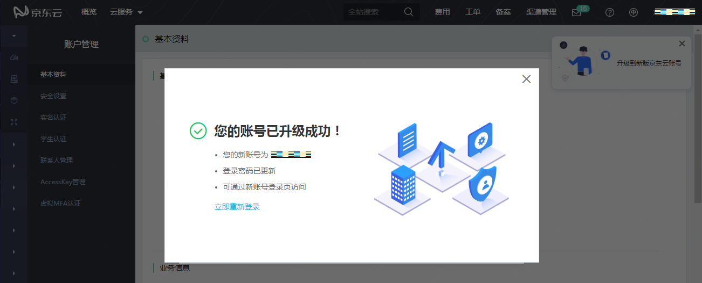
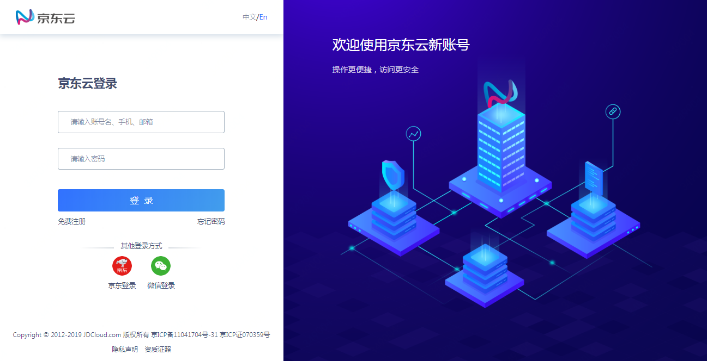

# Introduction to New JD Cloud Account

JD Cloud Account is a brand new account system. You can access JD Cloud via your JD account, but the new JD Cloud account can better fit in the cloud users’ using habits.

### New Feature of JD Cloud Account

**More friendly to enterprise users**

* The cloud account isolated to JD Mall’s personal business is not subject to JD login rules
* The newly-registered JD Cloud account is absolutely isolated to JD Mall
* After the original JD account is upgraded, a user can log in via his/her new JD Cloud account and password by default, but login via JD account is still supported (if you need to disable login access to JD, please open ticket for application)

**Upgrade account security policy**

* Update of Account Password and Verification Method Management
* Users can define login security policies, for example, restricting access to cloud resources via Internet outside the office

### How to upgrade to upgrade to new JD Cloud Account

Log in JD Cloud’s page of "Account Management-Basic Data", click **Update to the Latest JD Cloud Account** and the upgrade window is opened.

The "account name" in the upgrade window is your new account. The "account name" is as the same as your original JD account by default. If you need to change it, please click **Modify Account Name**.
Set and confirm the new account login password, click the **Upgrade Now** button and upgrade is completed.

After upgrade is successfully made, you can log in JD Cloud via the new account name and password. The new account login page is as shown below.
By default, JD Cloud supports account login still via the original JD Cloud account. If you need to disable access to JD Cloud account, please contact JD Cloud Customer Service or open ticket for application.

### FAQ

1. Will resources purchased under the account be affected after account upgrade?
A: No. Functions, including but not limited to resources, services and data in the account, will not be changed, except functions as login and security setting of account.

2. The enterprise account administrator has quitted, but the original JD account is the personal account of the administrator. Can problems of account password change and login failure be solved via upgrade? Is it possible to forbid access to enterprise cloud resources by the quitted staff?
A: After account upgrade, the password of original JD account and that of a new account are different. Enterprises can log in by setting a new account name and a password. However, JD Cloud will not disable the original JD login method by default. If an enterprise needs to disable access via the original JD account, it can open ticket for application. JD Cloud will handle the ticket within one working day and then disable access via JD account.

3. If I do not want any upgrade, what are the influences?
A: Users can still access their accounts from JD’s login entrance via the original JD account whenever. JD Cloud will not change security policies and login rules of original JD account.

4. Is the account registered on official page of JD Cloud a JD account or a new JD Cloud account?
A: Any account registered on official page of JD Cloud before July 18, 2019 is the JD Cloud and can be upgraded to the new JD Cloud account. Since July 18, 2019, the newly-registered accounts are the new JD Cloud account, which will not be associated with a JD account and cannot be used for logging in JD Mall.
