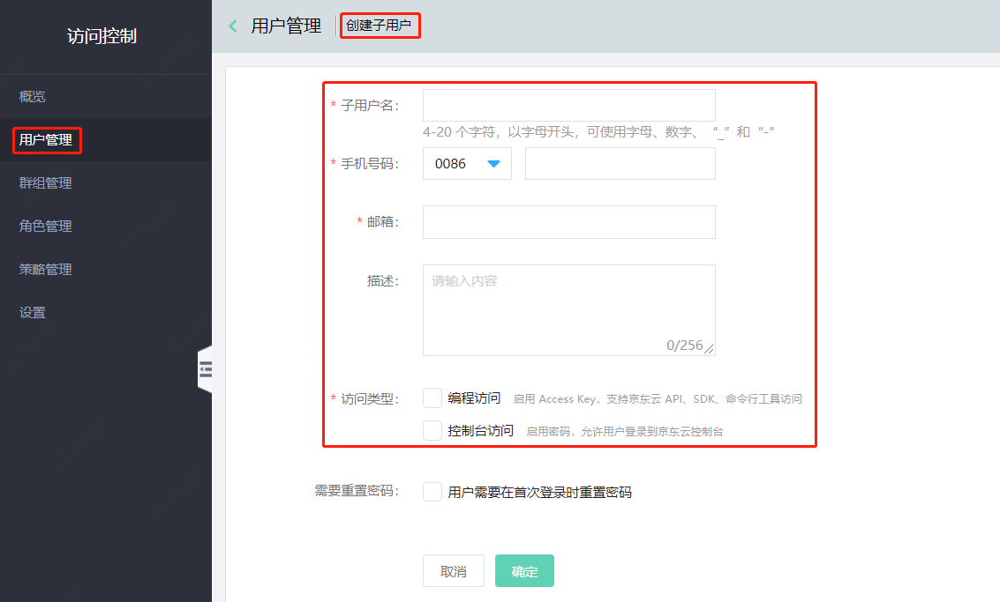
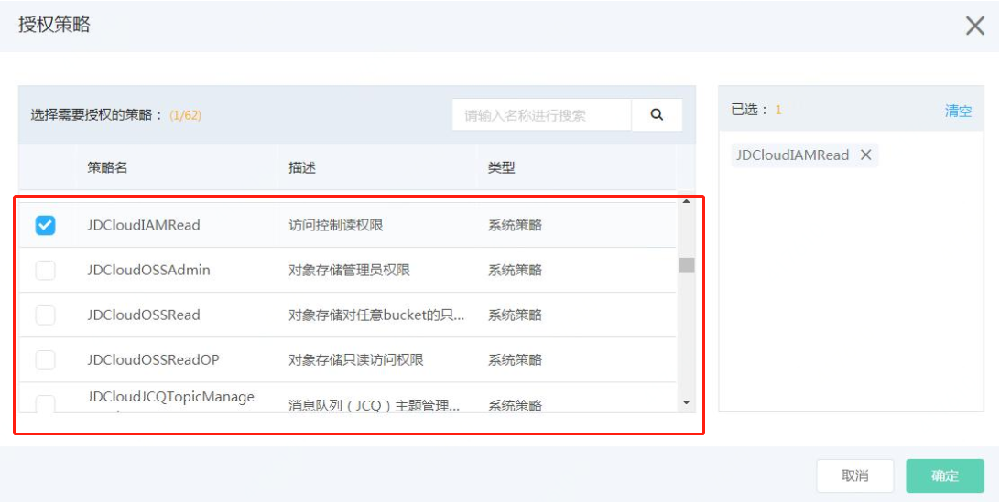

# IAM

   Identity and Access Management (IAM) is a user identity management and resource access control service provided by JD Cloud. User can use IAM to create, manage sub-user and control the operation permission of JD Cloud resources for them. The primary account can use IAM to authorize resources in the management account to others without sharing account password or access secret key and assign minimum permissions for the users as required to reduce the security risks of enterprise information.

-   Manage sub-users and control their access permissions – you can create sub-user in IAM and assign required console access password or access secret key separately for sub-users to access JD Cloud resources and services. You can set whether to enable Virtual MFA Verification and conduct Virtual MFA Verification when executing sensitive operations according to the security level of the sub-user. You can control specific operation permissions on specific resources for sub-users by means of using system policies or create customized policies.

-   Manage IAM roles and their permissions – you can create roles and manage permissions in IAM for the convenience of controlling to which operations that the sub-user or service playing the role can execute. You can define which sub-user to play the role and you can also use service roles or service relevant roles to designate relevant service to play the role, manage and operate other resources of JD Cloud on behalf of you.

-   The followings are brief introduction to the use of IAM. For details, please refer to the [Use Manual](https://docs.jdcloud.com/en/iam/product-overview) of IAM product.

## 1. What is a sub-user?

Sub-user is a kind of entity identity that has definite user name, password and AK/SK and it is usually corresponding to a certain definite entity, such as the enterprise technical personnel, operation and maintenance personnel, etc.

The user name of the sub-user is created by the primary account. The sub-user is not a unique JD Cloud account, it belongs to primary account and can be seen under the space of the primary account. It only has resource use right, but ownership of resources. The sub-user has no independent metering and billing, the using charge of resources will be recorded in the bill of the primary account uniformly. The sub-user must be granted by the primary account to login console or use Open API to operate resources granted by the primary account.

## 2. Create a sub-user

Log in JD Cloud Console, enter Identity and Access Management > User Management, and click the **Create** button to fill in the sub-user information in the sub-user create window. After the creation is successful, you can choose to download or download the password and access key information of the sub-user by mail.

## 3. Grant policy to sub-user

Access the sub-user list, click **Authorize** button to quickly grant appropriate policy to the sub-user. Here you can choose VOD products to grant policies that meet your business requirements.

