# Global Settings

## 1. Transcoding Settings

JD Cloud’s Video on Demand product provides two transcode methods, i.e., "Jingxiang Super Definition" and "Topspeed Transcode". Customers can create different template types in the template according to their own business demands. In the transcoding process, the "comfortable audio" function is also provided to bring better audio and video experience. For specific introduction, please refer to the document below.

**Jingxiang Super Definition: ** Jingxiang super definition transcode is based on JD Cloud’s unique "Intelligent Definition" coding and transcode technology. It enables intelligent analysis and treatment to contents, scenarios and images in videos, provide high-quality video, lower video code rate and effectively save use bandwidth and cost for customers, thus being suitable for most business scenarios.

**Topspeed transcode: ** Topspeed transcode is based on the "Particle Transcode" technology developed by JD Cloud on its own. It supports multiple transcode acceleration, greatly reducing transcode time and meeting customers’ demands for rapid production and release of videos. It is suitable for business scenarios where a large number of video sources are to be processed with high requirements on transcode speed, rapid release but low requirements on image quality.

**Comfortable audio: **The comfortable audio is based on JD Cloud’s unique "Enjoy Intelligent Audio" analysis and processing technology. It analyzes audio volume, automatically enables automatic gain and dynamic range adjustment for audios,
making volume transition between programs in different scenarios smoother and bringing more comfortable audio and video enjoyment to customers.

|Transcode Method  |Additional Function|Applicable Scenario|
|-|-|-|
|Jingxiang Super Definition|With Overlaid Watermark and Comfortable Audio|Improve definition while decreasing video code rate, suitable for most video processing scenarios,|
|Topspeed transcode|Comfortable audios can be overlaid and watermarks cannot be overlaid|Multiple transcode, suitable for video processing scenarios where image quality is insensitive, transcode speed requirements are high and rapid transcode is required|

### 1.1 Template Setting ###

Log in JD Cloud Console, click **Video on Demand** product among "Video Service" product types on the left view, select **Global Configuration** menu, click **Transcode Setting** sub-menu, and enter the transcode template management page.

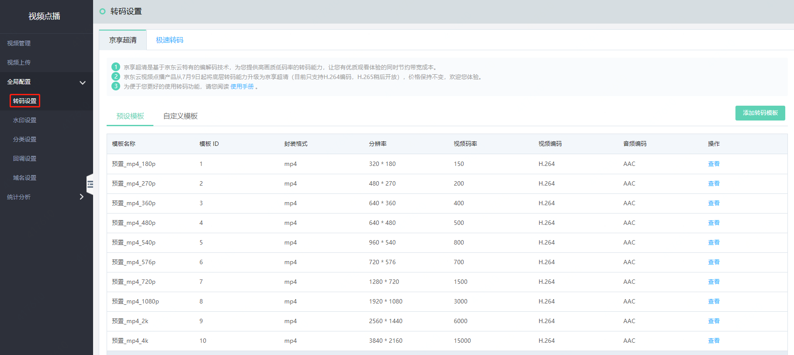

### 1.2 Jingxiang Super Definition Template ###

For template management, customers can manage corresponding templates by selecting the "Jingxiang Super Definition" tag page. The Jingxiang super definition template is divided into two types, i.e., the "Preset Template" and the "Customized Template". The preset template contains several common target resolution formats. If the preset template cannot meet your business demands, you can create a customized template via the **Add Transcode Template** button. Transcode parameters can be set according to actual demands. Meanwhile, other management operations such as edition and deletion can be made to templates in the template list.

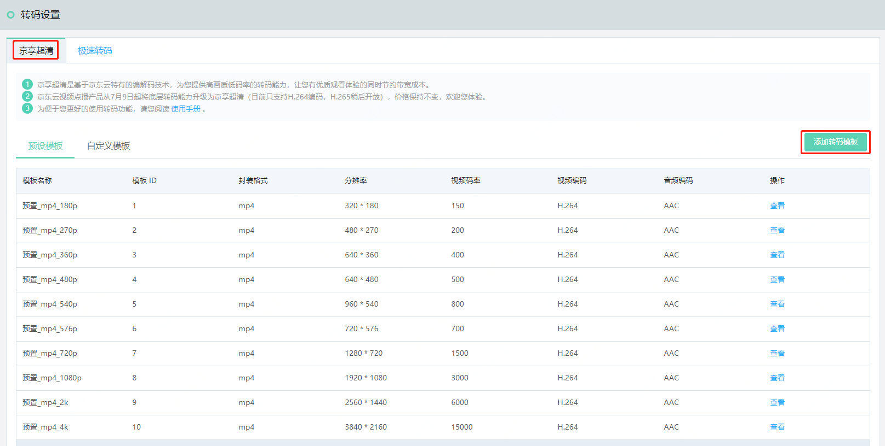

### 1.3 Topspeed Transcode Template ###

For template management, customers can manage corresponding templates by selecting the "Topspeed Transcode" tag page. Customized templates can be created via the **Add Transcode Template**. Transcode parameters can be set according to actual demands. Meanwhile, management operations such as edition and deletion can be made to templates in the template list.

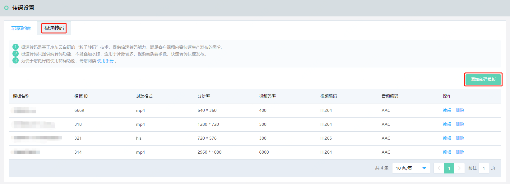

### 1.4 Transcode Template Parameter Setting ###

When adding the "Jingxiang Super Definition" or "Topspeed Transcode" template, you can set target transcode parameters according to your demands, including three parts such as "basic information", "video parameter" and "audio parameter". Parameters such as template names, video coding formats, video code rates, audio code rates can be set. The "Comfortable Audio" reinforcement function is provided to audio parameters of JD Cloud’s Video on Demand product. Once the function is enabled, automatic analysis and dynamic adjustment can be made to audio, making tone transition between different programs smoother and bringing better audio and video experience.

**Video Parameter Setting**

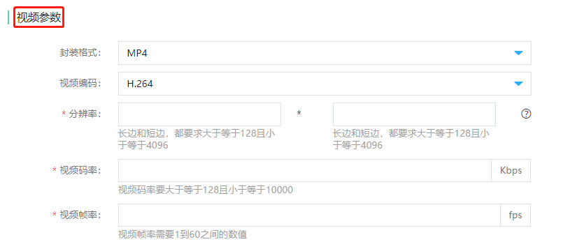

**Please note that for video resolution, the crown ratio supports automatic zooming by source video proportion, and the zooming rules are as follows:**

1. If the width and the height are both null, please keep the resolution unchanged

2. If the width is null, but the height is not null, please zoom out the width as per the original video proportion

3. If the width is not null, but the height is null, please zoom out the height as per the original video proportion

4. If neither the width nor the height is null, please process the video as per the values of the width and the height

**Audio Parameter Setting**

**Comfortable Audio Setting**

### 1.5 Common Transcode Parameter Recommendation ###

|Definition|Recommended Code Rate|Recommended Resolution|Resolution Range|
|-|-|-|-|
|Standard Definition|400Kbps|640x360|128x128~640x360|
|High Definition|1500Kbps|1280x720|641x361~1280x720|
|Super Definition|3000Kbps|1920x1080|1281x721~1920x1080|
|2K|3500Kbps|2560x1440|1921x1081~2560x1440|
|4K|6000Kbps|3840x2160|2561x1441~3840x2160|

## 2. Watermark Settings
Login VOD console, click **VOD**-**Global Configuration**-**Watermark Settings** on the menu bar at the left to access "Watermark Settings" page. You can click **Add Watermark Template** to add new watermark template(s). For existed watermark templates, you can click **Edit** in the template list to access Template Edit page for modifying watermark parameters in the templates.

The watermark width and height as well as the watermark displacement support setting by pixel and percentage both.

**Watermark Size**

|Configuration Unit|Description|
|-|-|
|Pixel|Set actual pixel size of a watermark image within the value range [8,4096]|
|Percentage|Proportion between the watermark and the actual picture, with value range (0,100)|

**Watermark Displacement**

|Configuration Unit|Description|
|-|-|
|Pixel|Set actual pixel size of a watermark image within the value range [8,4096]|
|Percentage|Proportion between the watermark and the actual picture, with value range (0,100)|

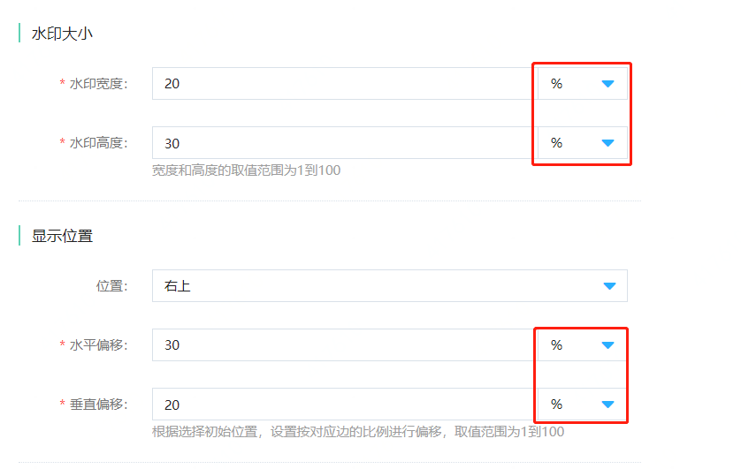

## 3. Category Settings
Login VOD console, click **VOD**-**Global Configuration**-**Category Settings** on the menu bar at the left to access "Category Configuration" page. You can add categories and sub-categories.

## 4. Domain Settings
### 4.1 Domain Addition
JD Cloud provides customer with one default domain by default. If you need to modify it, you can add your domains with ICP filing through Domain Setting and set them as default. You can also carry out operations of start, stop and deletion. You cannot delete your domain in starting until you stop it.

After adding the customized domain, the domain can be normally resolved and used only when the customer makes the cname association operation with the domain service provider. For specific operation steps, please refer to the Operation Guide of each domain service provider.
   
### 4.2 Identity and Access Management

VOD products support configuration in respect of playing domain security. Click the domain to be configured in the domain setting interface to go to the domain "access setting" page.

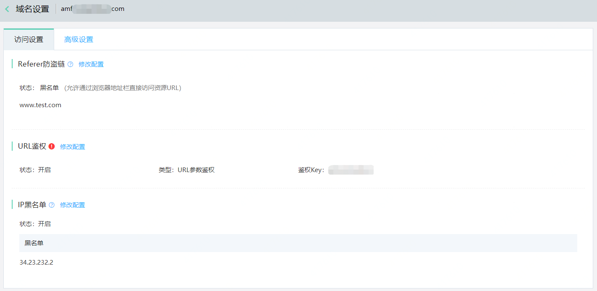

**A. Referer Anti-Leech**

Conduct visitor identification and filter by the configured access blacklist and whitelist to limit the situation where resources are accessed. Click the Modify Configuration option after Referer Anti-Leech, and configure rules in the pop-up window.

**B. URL Authentication**

Senior anti-leech function, encrypting URL by setting authentication KEY to fully protect resources on the origin server. Click the Modify Configuration option after URL Authentication, and configure in the pop-up dialog box based on demand. For the authentication details, please refer to contents in 4.3. In addition, after the authentication function is enabled, the following two points shall be noted:

1. After key Anti-Leech is enabled, the origin URL will not be able to be used for playing. Please generate URL with authentication for playing in accordance with the detailed content introduction in Section 4.3

2. After URL Authentication is enabled, the playing in hls format cannot be previewed at the Console temporarily

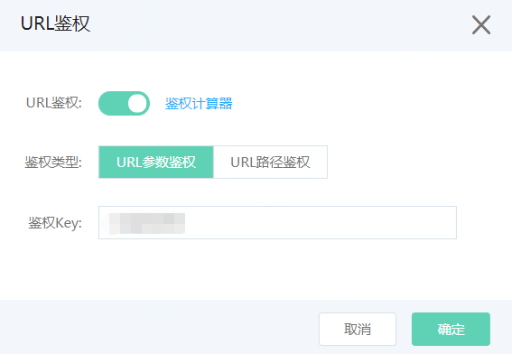

**C. IP Blacklist**

Visitor’s identity is identified and filtered through blacklist, and the IPs added to the blacklist will not be able to access the current accelerated domain.

### 4.3 URL Authentication Description

URL Authentication supports parameter and path authentication. The user can select appropriate authentication method depending on its own business situation to provide valid protection to origin server resources.

**A. Parameter Authentication Method**

1 Encrypted URL Composition

http://DomainName/Path/Filename?parameter&auth_token=expire-uniqid-rand-signature

signature =md5sum("uri-expire-uniqid-rand-private_key")

2 Authentication Field Description

|Field|Description|
|-|-|
|expire|Expiration time, 10-bit integers|
|uniqid|Integer, random, unique id, set to be 0 when not in use. The field can be used for marking identity or business and the user can set the field on its own|
|rand|Integer, random number, set to be 0 in general conditions, using time stamp when producing token as rand|
|signature|Character string, check string worked out with the md5 algorithm, mixture of numbers and lowercase English letters 0-9a-z, with fixed length of 32, case insensitive|
|uri|It is the relative address of the user’s request object, excluding parameters|
|private_key|Secrete key customized by the user (8-32 characters)|

3 Principle Description

When the CDN server gets the request, it will judge if expire in the request is before the current time. If yes, it is deemed as expired and the HTTP 403 error will be returned. If expire is later than the current time, a same character string will be constituted (refer to the following signature constitution method). Then, work out the new_signature with the MD5 algorithm and compare the new_signature with the signature in the request. Authentication is passed if the comparison results are consistent and the file will be returned. Otherwise, authentication is failed and the HTTP 403 error will be returned.

new_signature is worked by computing the following character strings:

origin_signature = "uri-expire-uniqid-rand-private_key " (uri is the relative address of the user’s request object, excluding parameters)

new_signature = md5sum(origin_ signature)

4. Example Description

Allow the request target:
http://cdn.example.com/video/standard/1K.html?fa=121&jd=121

The key is set to be: jdcloud1234 (set by the user)

The authentication configuration file is expired on June 18, 2020, 00:00:00, equaling to 1592409600 seconds by computing

The CDN server will constitute a signature character used for computing signature

/video/standard/1K.html-1592409600-0-0-jdcloud1234

The CDN server will compute the signature according to character strings of the signature:
signature = md5sum("/video/standard/1K.html-1592409600-0-0-jdcloud1234") =06d97bc9e43ded48d991994006cfa127

url at the request is:
http://cdn.example.com/video/standard/1K.html ?fa=121&jd=121&auth_token=1592409600-0-0-06d97bc9e43ded48d991994006cfa127

The signature worked out is consistent with the value of signature =06d97bc9e43ded48d991994006cfa127 in the user’s request, thus the authentication is passed.

**B. Path Authentication Method**

1 Encrypted URL Composition

http://DomainName/deadline/ md5sum("uri-deadline-password")/Path/Filename?parameter

2 Authentication Field Description

|Field|Description|
|-|-|
|deadline|Expiration time, 10-bit integers|
|uri|It is the relative address of the user’s request object, excluding parameters|
|password|Secrete key customized by the user (8-32 characters|
|md5hash|Check string worked out with the md5 algorithm, mixture of numbers and lowercase English letters 0-9a-z, with fixed length of 32, case insensitive|

3 Principle Description

When the CDN server gets the request, it will judge if deadline in the request is before the current time. If yes, it is deemed as expired and the HTTP 403 error will be returned. If deadline is later than the current time, a same character string will be constituted (refer to the following sstring constitution method). Then, work out the HashValue with the MD5 algorithm and compare it with the md5hash in the request. Authentication is passed if the comparison results are consistent and the file will be returned. Otherwise, authentication is failed and the HTTP 403 error will be returned.

HashValue is worked by computing the following character strings:

sstring = "uri-deadline-Password" (uri is the relative address of the user’s request object, excluding parameters)

HashValue = md5sum(sstring)

4. Example Description

Allow the request target:
http://cdn.example.com/video/standard/1K.html ?fa=121&cc=121

The key is set to be: jcloud1234 (set by the user)

The authentication configuration file is expired on June 18, 2020, 00:00:00, equaling to 1592409600 seconds by computing

The CDN server will constitute a signature character used for computing Hashvalue

/video/standard/1K.html-1592409600-jcloud1234"

The CDN server will compute the HashValue according to character strings of the signature:
HashValue = md5sum("/video/standard/1K.html-1592409600-jcloud1234") = 8afb0900782e14c35214ccda534a3679

url at the request is:
http://cdn.example.com/1592409600/8afb0900782e14c35214ccda534a3679/video/standard/1K.html? fa=121&cc=121

The authentication is passed if the HashValue worked out is consistent with the value of md5hash = 8afb0900782e14c35214ccda534a3679 in the user’s request.

### 4.3 Advanced Settings

On the domain setting interface, click the domain to be configured, enter the specific domain configuration page, select a senior page and the relevant advanced domain setting can be viewed. Now, setting of the parameter HTTP Header is supported.

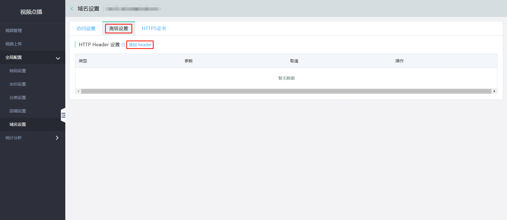

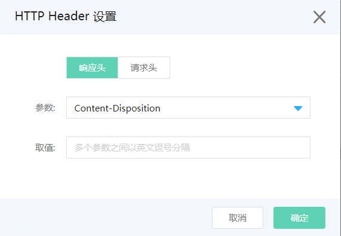

### 4.4 HTTPS Certificate Setting

Also on the domain setting interface, click the domain to be configured, enter the specific domain configuration page and click the HTTPS certificate configuration page. Then, HTTPS certificates can be added to the current domain and the redirection rules can be set.

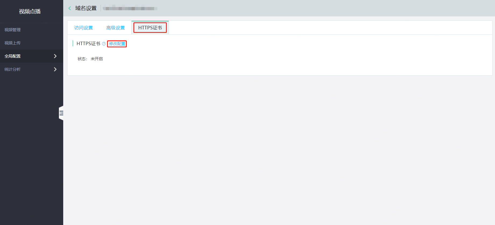

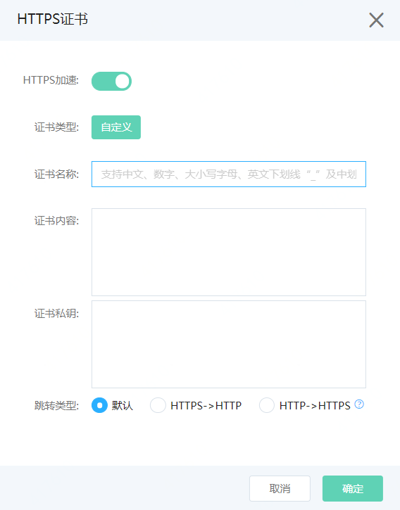

Redirection Type Description:

Default means: If client protocol is HTTP, then the request protocol to a CDN node is HTTP, HTTPS in a similar way.

HTTPS -> HTTP: If client protocol is HTTPS, then the request protocol to a CDN node is HTTP.

HTTP -> HTTPS means: If client protocol is HTTP, then the request protocol to a CDN node is HTTPS。

## 5. Callback Settings
VOD supports message subscription of task completion. If customers need to obtain message notifications of upload completion, transcoding completion, they can set callback URL and callback events in the Callback Settings, which relevant events will be timely notified to customers through URL they entered.

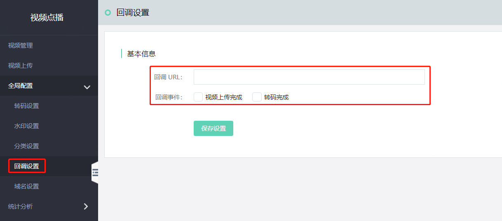

