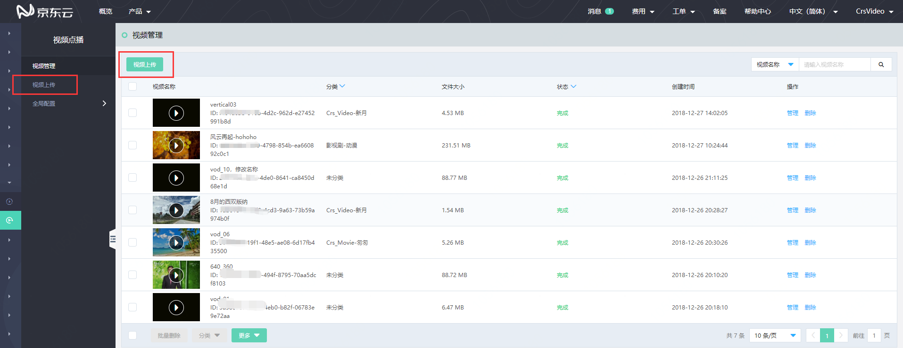
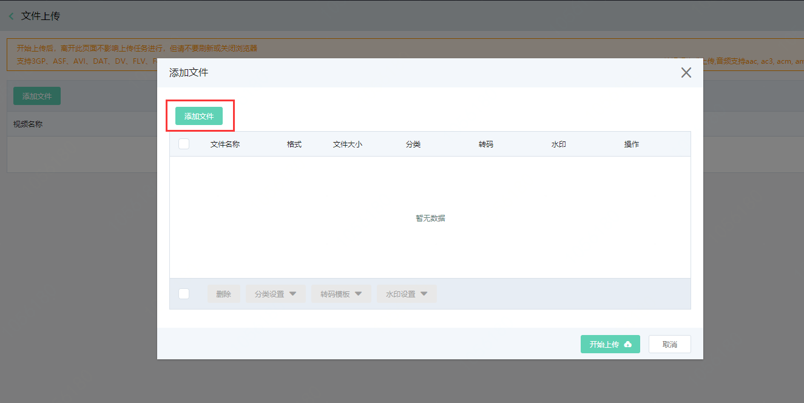
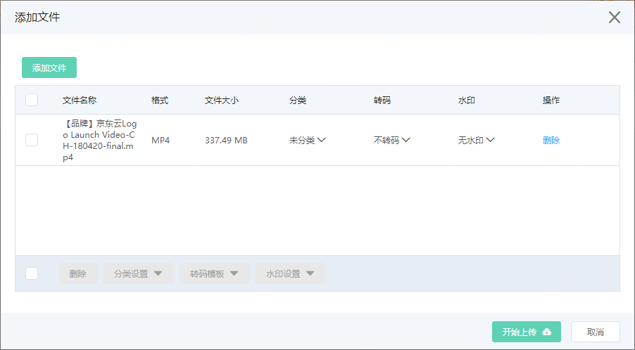
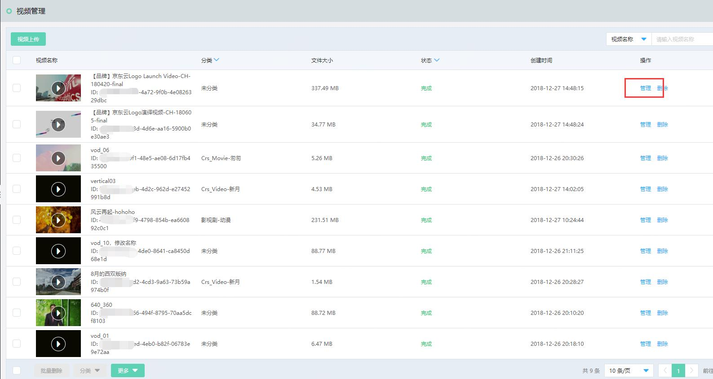
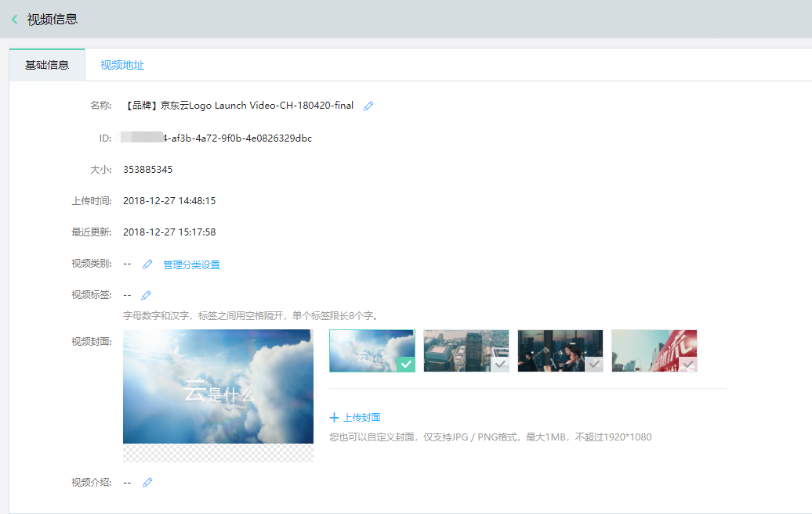
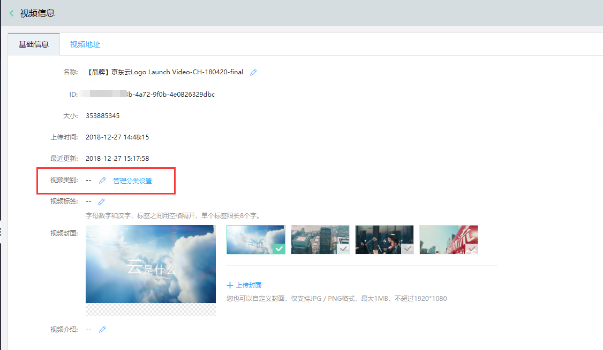
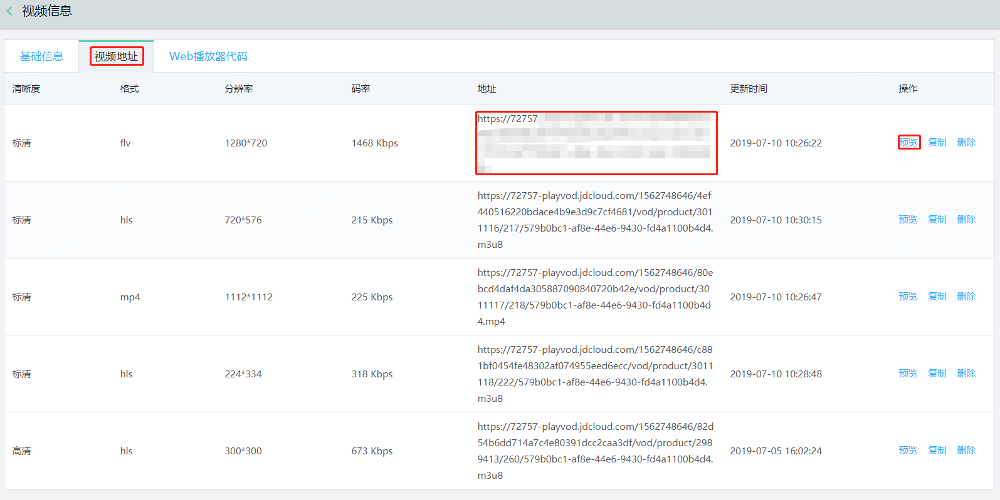

# Video Management

## 1. Video Upload
Login VOD console, click **Video Upload** on the menu bar at the left to access "File Upload" page. You can click **Add File** button to click **Add File** again in the pop-up box to pop up Local File Browsing Window, then select the file and click **Start to Upload**.

## 2. Video Management
Login VOD console, click **VOD**-**Video Management** on the menu bar at the left to access Video Management page. Click **Management** in the video list to access Video Information page of single video file where file name, category settings, tag and video introduction can be viewed and modified. If your video has been transcoded, then 4 snapshots will be automatically generated, which can be selected as the cover for you.

## 3. Video Category
Click **Management** below the video management list to access Video Management page where Category Types can be modified through "Video Category" drop-down list in the Basic Information. If you need to add or delete video categories, you can click **Manage Category Settings** to access Category Settings subpage 

Click **Create Category** to show characters of "Create Category" in the list, Click **Modify** or **Delete** to complete corresponding operations. 

## 4. Video Play Address   

Click **Management** in video management list to enter the video detail information page, click **Video Address** tag page to view play addresses of video file with different definition specifications and preview some video. Note that if the authentication function is enabled in the domain settings of global configuration, generate authenticated addresses after referring to the description documents of authentication settings in the global configuration domain settings before playing.

## 5. Web Player Code

Click **Management** in video management list to enter the video detail information page, click **Web player code** tag to view Web player embedded code generated by the system automatically, and directly click **Replicate** button to replicate the dispute code in the development page to complete quick creation and business connection of play page.

**For player code parameters, please refer to the table below**
	
|Parameter Name|Parameter Description|Value Description|
|-|-|-|
|autoplay|Autoplay Setting|true: Autoplay Setting    false: No Autoplay|
|controls|Display Control Strip|true: Display   false: No Display|
|loop|Loop Playback or not|true: Loop Playback  false: No loop playback|
|aspectRatio|Video Display Aspect Ratio|Value refers to the character string, e.g., "16:9" and "4:3"|
|muted|Mute Setting|true: Mute  false: Non-mute|
|width|Player Width|Value: Character String or number, unit pixel (px), e.g.: width:300 or width:'300px'|
|height|Player Height|Value: Character String or number, unit pixel (px), e.g.: height:300 or height:'300px'|
    
